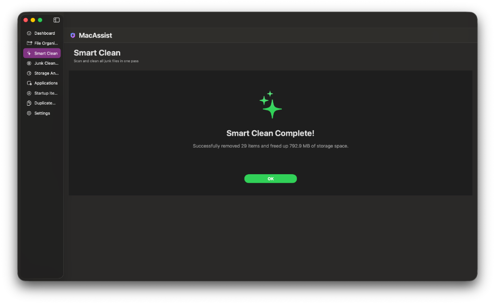
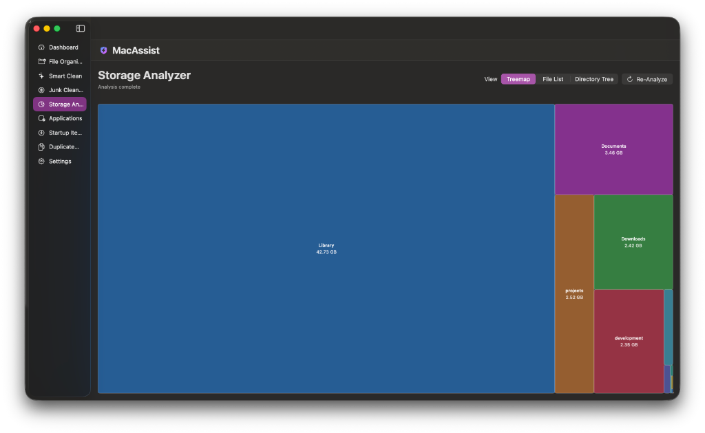
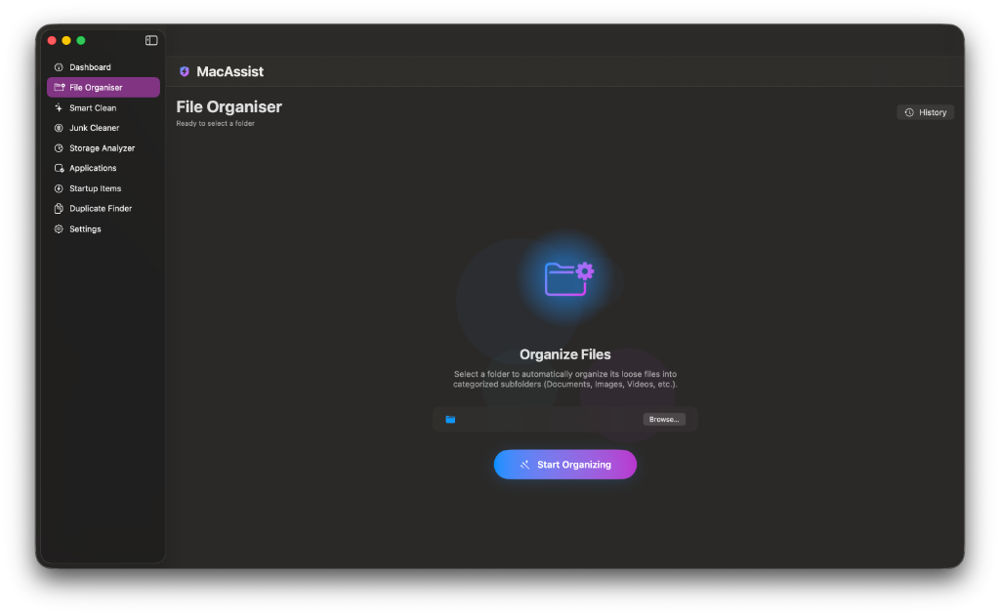
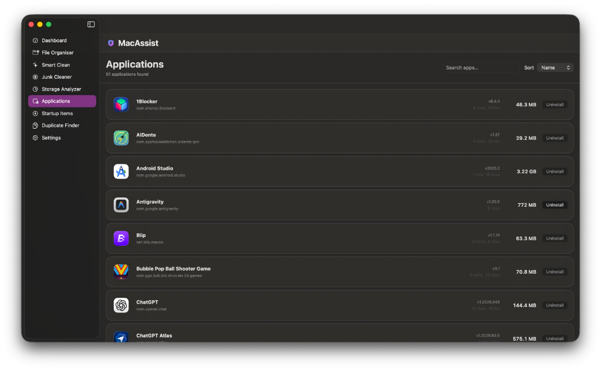

# MacAssist

MacAssist is a comprehensive, elegant system utility and cleaning application built specifically for macOS. It is designed to optimize your Mac's performance, manage your files efficiently, and effortlessly free up disk space using modern native UI.

## 🚀 Features

*   **Smart Clean & Junk Cleaner**: Automatically analyze the system for unnecessary files such as unneeded application caches, logs, and temporary files. Safely reclaims valuable disk space in a single click.
*   **Large & Duplicate File Finder**: Rapidly identify and eliminate space-consuming duplicate files or unusually large files scattered across your Mac. Includes a full Storage Analyzer for a clear view of what's taking up space.
*   **File Organiser**: Keep your Desktop, Downloads, and Documents folders neat. The File Organiser automates sorting files into categorized folders, coming with historical tracking for piece of mind and easy reversals.
*   **App Manager (Uninstaller)**: Go beyond dragging an app to the trash. Fully remove applications alongside all their hidden associated files, preventing leftover junk from accumulating over time.
*   **Startup Manager**: Take control of your macOS boot process. View, enable, disable, or manage Launch Agents and Login Items to significantly reduce your boot time and improve background performance.
*   **Developer Cleanup**: A dedicated cleanup engine targeting leftover developer cache files, Xcode Derived Data, old archives, and simulator files that quickly gobble up gigabytes of storage.
*   **Actionable Insights**: Gives peace of mind by explaining exactly what is being deleted and why it's completely safe to do so.

## 🖼 Screenshots


<div align="center">
  <h3>Smart Clean</h3>
  
</div>

<div align="center">
  <h3>Storage Analyzer</h3>
  
</div>

<div align="center">
  <h3>File Organiser</h3>
  
</div>

<div align="center">
  <h3>App Manager</h3>
  
</div>

## 📥 Installation

### Option 1 — Download the DMG (Recommended)

1. Go to the [**Releases**](https://github.com/vikram-mistry/MacAssist/releases) page.
2. Download the latest `MacAssist-<version>.dmg` file.
3. Open the DMG and drag **MacAssist.app** into your **Applications** folder.
4. Eject the disk image.

> **⚠️ Important — macOS Gatekeeper Notice**
>
> MacAssist is currently **not signed with an Apple Developer certificate**, so macOS Gatekeeper may block it from launching with a message like *"MacAssist cannot be opened because it is from an unidentified developer."*
>
> This is a known limitation for open-source apps distributed outside the Mac App Store. Your data and system are **completely safe** — follow the steps below to bypass this restriction.

---

### 🔓 Bypassing Gatekeeper (Required for Unsigned Builds)

After moving MacAssist to your Applications folder, run the following one-time command in Terminal to remove the quarantine flag:

**Step 1 — Open Terminal**

Press **Cmd + Space**, type `Terminal`, and hit **Enter**.

**Step 2 — Run the quarantine removal command**

```bash
xattr -rd com.apple.quarantine /Applications/MacAssist.app
```

**Step 3 — Launch MacAssist normally**

You can now open MacAssist from your Applications folder or Launchpad as usual.

> **Why is this needed?**
> When you download any app from the internet, macOS tags it with a "quarantine" attribute that triggers Gatekeeper checks. The command above simply removes that tag — it does **not** disable Gatekeeper system-wide or affect any other applications.

---

### Option 2 — Build from Source

**Requirements:**
- macOS 13.0 (Ventura) or later
- Xcode 15 or later

**Steps:**

```bash
# 1. Clone the repository
git clone https://github.com/vikram-mistry/MacAssist.git
cd MacAssist

# 2. Open in Xcode
open MacAssist.xcodeproj

# 3. Build & Run (Cmd+R) in Xcode, or build via command line:
xcodebuild -project MacAssist.xcodeproj \
           -scheme MacAssist \
           -configuration Release \
           -derivedDataPath build/
```

**Creating a DMG from source:**

```bash
# Make the script executable and run it
chmod +x build_dmg.sh
./build_dmg.sh
```

This will produce `MacAssist-1.0.dmg` in the project root.

---

## 🛠 Tech Stack

*   **Language**: Swift
*   **UI Framework**: SwiftUI natively designed for macOS 
*   **Architecture**: MVVM (Model-View-ViewModel)

## 📦 Project Structure
- `CoreEngine/`: Includes various scanning engines like `JunkScanner`, `LargeFileScanner`, `CacheScanner`, etc.
- `Services/`: Modular services for `AppUninstallService`, `DuplicateFinderService`, `FileOrganiserService`, etc.
- `ViewModels/`: Handles the business logic mapping our core features to the SwiftUI views.
- `Views/`: SwiftUI View structures implementing an intuitive, native UI macOS layout.

## 🤝 Contributing

Contributions, bug reports, and feature requests are welcome! Feel free to open an [issue](https://github.com/vikram-mistry/MacAssist/issues) or submit a pull request.

## 📝 License

This project is licensed under the MIT License.
