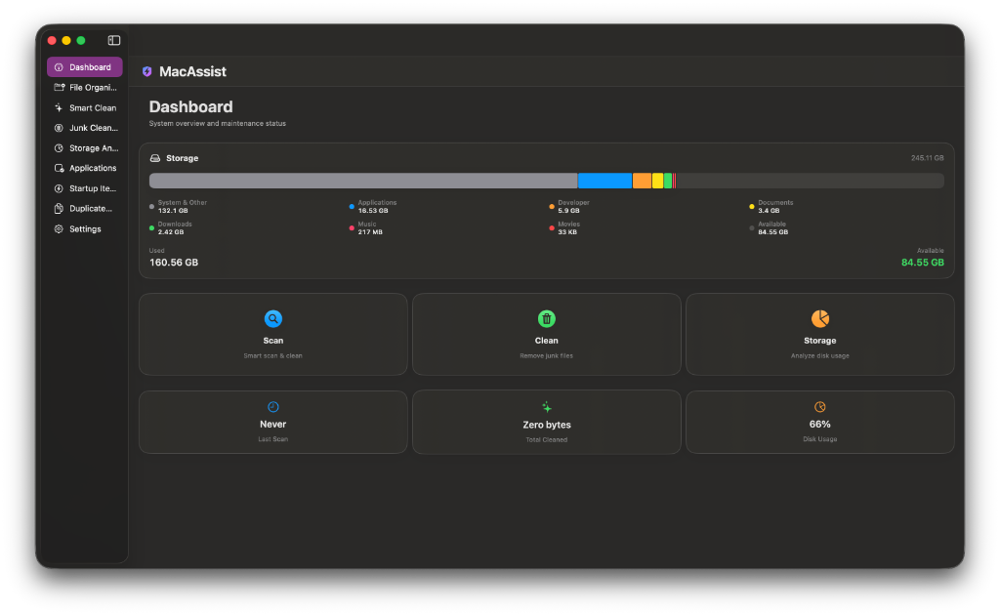

# MacAssist

MacAssist is a comprehensive, elegant system utility and cleaning application built specifically for macOS. It is designed to optimize your Mac's performance, manage your files efficiently, and effortlessly free up disk space using modern native UI.

## 🚀 Features

*   **Smart Clean & Junk Cleaner**: Automatically analyze the system for unnecessary files such as unneeded application caches, logs, and temporary files. Safely reclaims valuable disk space in a single click.
*   **Large & Duplicate File Finder**: Rapidly identify and eliminate space-consuming duplicate files or unusually large files scattered across your Mac. Includes a full Storage Analyzer for a clear view of what’s taking up space.
*   **File Organiser**: Keep your Desktop, Downloads, and Documents folders neat. The File Organiser automates sorting files into categorized folders, coming with historical tracking for piece of mind and easy reversals.
*   **App Manager (Uninstaller)**: Go beyond dragging an app to the trash. Fully remove applications alongside all their hidden associated files, preventing leftover junk from accumulating over time.
*   **Startup Manager**: Take control of your macOS boot process. View, enable, disable, or manage Launch Agents and Login Items to significantly reduce your boot time and improve background performance.
*   **Developer Cleanup**: A dedicated cleanup engine targeting leftover developer cache files, Xcode Derived Data, old archives, and simulator files that quickly gobble up gigabytes of storage.
*   **Actionable Insights**: Gives peace of mind by explaining exactly what is being deleted and why it's completely safe to do so.

## 🖼 Screenshots

  <h3>Dashboard</h3>
  

  <h3>Smart Clean</h3>
  

  <h3>Storage Analyzer</h3>
  

  <h3>File Organiser</h3>
  

  <h3>App Manager</h3>
  

## 🛠 Tech Stack

*   **Language**: Swift
*   **UI Framework**: SwiftUI natively designed for macOS 
*   **Architecture**: MVVM (Model-View-ViewModel)

## 📦 Project Structure
- `CoreEngine/`: Includes various scanning engines like `JunkScanner`, `LargeFileScanner`, `CacheScanner`, etc.
- `Services/`: Modular services for `AppUninstallService`, `DuplicateFinderService`, `FileOrganiserService`, etc.
- `ViewModels/`: Handles the business logic mapping our core features to the SwiftUI views.
- `Views/`: SwiftUI View structures implementing an intuitive, native UI macOS layout.

## 📝 License

This project is licensed under the MIT License.
